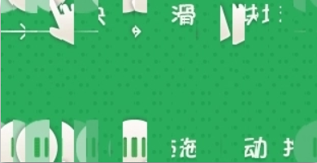
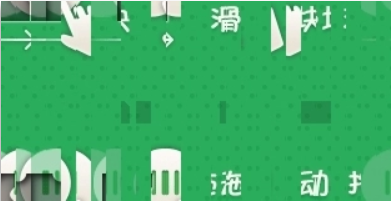
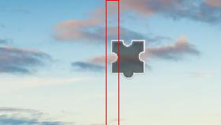
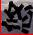
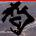

# interactive_captcha
交互式验证码（滑动、点选等）的识别方案和例子。

# 1. cases
记录平时研究的一些验证码案例
## 1.1 安居客
> 部分参考自 [clllanqing/slove_captcha/anjuke](https://github.com/clllanqing/slove_captcha/tree/master/anjuke)  

[源滑动验证码地址](https://www.anjuke.com/captcha-verify/?callback=shield)  

## 1.2 bilibili
> 部分参考自 [leng-yue/Lengyue-Vcode/bilibili](https://github.com/leng-yue/Lengyue-Vcode/tree/master/%E6%BB%91%E5%8A%A8%E9%AA%8C%E8%AF%81%E7%A0%81/Geetest)  
> 部分参考自 [OSinoooO/bilibili_geetest](https://github.com/OSinoooO/bilibili_geetest)  
[源滑动验证码地址](https://passport.bilibili.com/login)  

# 2. module
记录与滑动验证码相关的一些技巧
## 2.1 图片合并
 加上   
等于：  

## 2.2 发现缺口
  
使用图像识别算法发现缺口位置：  

## 2.3 目标检测
  
识别文字区域：  
  
切割文字然后使用分类器识别：

# 3. 说明
感谢为本项目提供思路的大佬和项目~
此项目用于学习和研究web技术，案例仅提供思路。  
